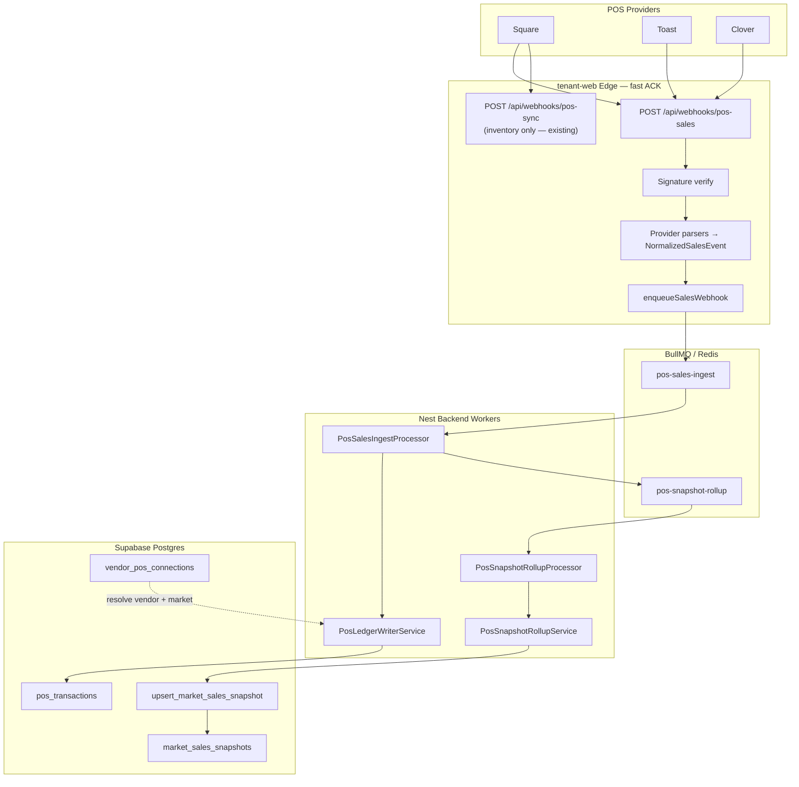

# Webhook Transaction Tracking — Implementation Blueprint

**Epic:** Active POS webhook → `pos_transactions` → `market_sales_snapshots`  
**Baseline:** `main` @ PR #68+, Phase 44 applied  
**Status:** **Phase B + C implemented** — Square sales webhooks write the ledger and roll up snapshots; Toast/Clover parsers exist but need provider verification before production traffic.

---

## 1. Problem statement

Today the repo runs **two parallel POS pipelines**:

| Pipeline | Webhook entry | Ledger table | Rollup |
|----------|---------------|--------------|--------|
| **Legacy Nest** | `POST /pos/webhooks/:provider` | `pos_imported_transactions` | `analytics_snapshots` |
| **Vendorly phase43/44** | *(none)* | `pos_transactions` | `market_sales_snapshots` via `upsert_market_sales_snapshot()` |

The vendor dashboard (`web/src/lib/pos-transactions.ts`) already reads `pos_transactions` with realtime — but **no writer exists**. Phase 44 rollup RPC is live in Supabase but **never invoked from application code**.

This epic unifies inbound sales webhooks into the phase43/44 path.

---

## 2. Target architecture



### Design principles

1. **Edge ACK < 200ms** — tenant-web verifies signature, enqueues, returns 200 (mirrors inventory `pos-sync`).
2. **Idempotent ingest** — job id = `{provider}:{providerEventId}`; DB unique on `(provider, external_transaction_id)`.
3. **Service-role writes** — workers use `SUPABASE_SERVICE_ROLE_KEY` for `pos_transactions` + RPC (RLS blocks direct client writes).
4. **Debounced rollup** — one `pos-snapshot-rollup` job per `(vendor_id, market_id, snapshot_date)` with 5s delay (coalesce bursts).
5. **Inventory stays separate** — do not mix sales + inventory in one route handler.

---

## 3. Webhook ingestion router

### Route layout (tenant-web)

| Method | Path | Responsibility |
|--------|------|----------------|
| `POST` | `/api/webhooks/pos-sales` | **NEW** — payment/order/refund events → sales queue |
| `POST` | `/api/webhooks/pos-sync` | **Existing** — inventory events only |
| `GET` | `/api/webhooks/pos-sales` | Health: `{ ok: true, endpoint: 'pos-sales-ingest' }` |

Query param fallback: `?provider=SQUARE|TOAST|CLOVER` (same pattern as inventory).

### Provider dispatch

```
POST /api/webhooks/pos-sales
  ├─ resolveProvider(request)          → square | toast | clover
  ├─ read rawBody (text)
  ├─ parseSalesWebhook(provider, body, headers)
  │    ├─ verify signature
  │    ├─ extract eventType, eventId, merchantId, locationId
  │    └─ if sales-relevant → NormalizedSalesEvent[]
  ├─ for each event: enqueueSalesWebhook(jobData)
  └─ 200 { ok: true, queued: N }
```

### Sales-relevant event filters

| Provider | Prefixes / types |
|----------|------------------|
| Square | `payment.`, `refund.`, `order.` |
| Toast | `order`, `payment`, `check` *(verify docs)* |
| Clover | `PAYMENT`, `REFUND`, `ORDER` *(verify docs)* |

Reuse `isWebhookSyncRelevant()` logic from `backend/src/modules/pos/services/pos-webhook.service.ts`.

### Legacy Nest bridge (optional phase 2)

Keep `POST /pos/webhooks/:provider` on Railway for backward compatibility. Add adapter hook:

```
PosWebhookService.handleInbound()
  → existing pos-sync queue (legacy)
  → ALSO enqueue mirror job to pos-sales-ingest (feature flag POS_LEDGER_MIRROR=true)
```

---

## 4. Queue / worker boundary

### New BullMQ queues

| Queue | Job name | Producer | Consumer | Concurrency |
|-------|----------|----------|----------|-------------|
| `pos-sales-ingest` | `ingest-sales-webhook` | tenant-web `pos-sales` route | `PosSalesIngestProcessor` | 10 |
| `pos-snapshot-rollup` | `rollup-vendor-market-day` | ingest processor (debounced) | `PosSnapshotRollupProcessor` | 5 |

### Job payloads

**`PosSalesIngestJobData`** (tenant-web → Redis):

```typescript
interface PosSalesIngestJobData {
  provider: 'square' | 'toast' | 'clover';
  providerEventId: string;
  eventType: string;
  providerMerchantId?: string;
  providerLocationId?: string;
  /** Pre-parsed when edge has enough context; else worker fetches detail API */
  transactions: NormalizedLedgerTransaction[];
  observedAt: string;
  rawPayload: Record<string, unknown>;
}
```

**`PosSnapshotRollupJobData`**:

```typescript
interface PosSnapshotRollupJobData {
  vendorId: string;
  marketId: string;
  tenantId?: string | null;
  posConnectionId?: string | null;
  snapshotDate: string; // YYYY-MM-DD
  /** Tender counts from parsed webhook for payment_method_distribution */
  tenderBreakdown?: Record<string, number>;
}
```

### Worker: `PosSalesIngestProcessor`

```
1. Resolve vendor_pos_connections by (provider, merchantId, locationId)
2. Reject if connection.status !== 'active'
3. For each NormalizedLedgerTransaction:
     PosLedgerWriterService.upsertTransaction()
4. Resolve market_id via vendor_market_registrations + location mapping
5. Enqueue debounced PosSnapshotRollupJobData
```

### Worker: `PosSnapshotRollupProcessor`

```
1. Call supabase.rpc('upsert_market_sales_snapshot', { p_market_id, p_vendor_id, p_snapshot_date, ... })
2. PATCH market_sales_snapshots SET
     payment_method_distribution = computeFractions(tenderBreakdown),
     tender_breakdown = tenderBreakdown
   WHERE market_id + vendor_id + snapshot_date
```

---

## 5. Rollup layer — payload processing map

### Normalized → `pos_transactions`

| Normalized field | DB column | Notes |
|------------------|-----------|-------|
| `providerTransactionId` | `external_transaction_id` | unique with `provider` |
| `grossAmount` | `gross_amount` | cents |
| `platformFee` | `platform_fee` | cents; from fee policy |
| *(generated)* | `net_amount` | `gross - platform_fee` |
| `soldAt` | `sold_at` | timestamptz |
| `currency` | `currency` | default USD |
| `connectionId` | `connection_id` | FK `vendor_pos_connections` |
| `vendorId` | `vendor_id` | from connection |
| `provider` | `provider` | enum slug |
| `raw` | `raw_payload` | jsonb audit |

### Transaction → snapshot rollup trigger

```
soldAt (ISO) ──► snapshot_date = soldAt.slice(0, 10)  // UTC or market timezone (phase 2)

vendorId + marketId + snapshot_date
  ──► debounce key: rollup:{vendorId}:{marketId}:{snapshotDate}
  ──► delay 5s
  ──► upsert_market_sales_snapshot(vendorId, marketId, date)
  ──► merge tenderBreakdown into payment_method_distribution
```

### Tender → distribution map

| `NormalizedTenderType` | `tender_breakdown` key | `payment_method_distribution` |
|------------------------|------------------------|-------------------------------|
| `CARD` | `card` | `card / total` |
| `CASH` | `cash` | `cash / total` |
| `GIFT_CARD` | `gift_card` | `gift_card / total` |
| `OTHER` | `other` | `other / total` |

---

## 6. Directory schema (implemented)

```
tenant-web/src/
├── app/api/webhooks/
│   ├── pos-sync/route.ts              # inventory only
│   └── pos-sales/route.ts             # sales ingest router (Phase B)
└── lib/pos/
    ├── inventory-queue.ts
    ├── sales-queue.ts                 # BullMQ producer (Upstash-safe job ids)
    └── sales/
        ├── types.ts
        ├── router.ts
        └── providers/
            ├── square.ts
            ├── toast.ts
            └── clover.ts

backend/src/modules/pos/
├── jobs/
│   ├── pos-sales-queue.constants.ts
│   ├── pos-sales-ingest.processor.ts
│   └── pos-sales-jobs.service.ts
├── processors/
│   └── pos-snapshot-rollup.processor.ts   # Phase C consumer
├── services/
│   ├── pos-ledger-writer.service.ts
│   ├── pos-snapshot-rollup.service.ts     # RPC + tender PATCH
│   ├── pos-sales-ingest.service.ts
│   └── pos-market-resolver.service.ts
├── utils/
│   └── tender-aggregation.ts
└── types/
    └── ledger-transaction.ts

scripts/
└── e2e-phase-c-pipeline.ts          # seed → webhook → workers → SQL validation
```

---

## 7. Type configurations

Shared contract lives in `tenant-web/src/lib/pos/sales/types.ts` (edge) and mirrored in `backend/src/modules/pos/types/ledger-transaction.ts` (worker). Keep shapes aligned manually until a `packages/pos-contracts` package exists.

See scaffold files for full TypeScript definitions.

---

## 8. Environment variables

| Variable | Where | Purpose |
|----------|-------|---------|
| `REDIS_URL` | tenant-web + backend | BullMQ (same Upstash TCP URL on both) |
| `POS_QUEUES_ENABLED` | backend | `true` in production — registers ingest + rollup workers |
| `SUPABASE_URL` | tenant-web + backend | DB + PostgREST RPC |
| `SUPABASE_SERVICE_ROLE_KEY` | backend worker | Ledger writes + `upsert_market_sales_snapshot` RPC |
| `POS_SALES_WEBHOOK_URL` | tenant-web | Public URL registered with Square (must match signature base) |
| `SQUARE_WEBHOOK_SIGNATURE_KEY` | tenant-web | Square sales + inventory HMAC |
| `TOAST_WEBHOOK_SECRET` | tenant-web | Toast HMAC |
| `CLOVER_WEBHOOK_SECRET` | tenant-web | Clover verification |
| `POS_SALES_WEBHOOK_TEST_MODE` | tenant-web | Dev only — ACK webhooks when Redis is down |
| `POS_WEBHOOK_TEST_MODE` | tenant-web | Alias for test-mode bypass above |

**Job ID constraint:** BullMQ custom ids must not contain `:` (Upstash rejects them). Use `ingest-{provider}-{eventId}` and `rollup-{vendorId}-{marketId}-{date}` — see `sales-queue.ts` and `pos-sales-queue.constants.ts`.

---

## 9. Implementation phases

| Phase | Scope | Status |
|-------|-------|--------|
| **A** | Scaffold + types + routes | ✅ Merged (PR #68) |
| **B** | Square sales webhook → `pos_transactions` | ✅ `PosSalesIngestProcessor` + `PosLedgerWriterService` |
| **C** | Snapshot rollup worker + tender mix | ✅ `PosSnapshotRollupProcessor` + `upsert_market_sales_snapshot` RPC |
| **D** | Toast + Clover parsers in production | 🟡 Parsers exist; verify provider signatures before live traffic |
| **E** | Nest mirror + legacy backfill | 🔲 `pos_imported_transactions` → ledger bridge (optional) |

---

## 10. Verification checklist

```bash
# Baseline
npm run build:web
npm run build:tenant-web
npm run smoke:ui-baseline

# Phase B/C E2E (local — seeds vendor, posts Square webhook, runs inline workers)
# Requires DATABASE_URL + REDIS_URL in backend/.env or root .env
npx tsx scripts/e2e-phase-c-pipeline.ts

# Production workers (Railway backend with POS_QUEUES_ENABLED=true)
# tenant-web enqueues; backend consumes pos-sales-ingest + pos-snapshot-rollup
cd backend && npm run start:dev   # or deployed container

# SQL validation
select count(*) from pos_transactions;
select tender_breakdown, payment_method_distribution
  from market_sales_snapshots order by snapshot_date desc limit 5;
```

### Rollup lifecycle (Phase C)

`PosSnapshotRollupService.rollupVendorMarketDay()` runs three PostgREST steps:

1. **RPC** — `upsert_market_sales_snapshot(p_market_id, p_vendor_id, p_snapshot_date, …)` aggregates volume from `pos_transactions`.
2. **Ledger scan** — fetch vendor `pos_transactions` for the UTC day; `aggregateTenderBreakdown()` counts card/cash/gift_card/other from `raw_payload`.
3. **PATCH** — update `market_sales_snapshots.tender_breakdown` and `payment_method_distribution`.

Rollup jobs debounce **5 seconds** per `(vendor_id, market_id, snapshot_date)`; duplicate jobs merge tender counts via `mergeTenderBreakdown()`.

---

## 11. Related files (existing)

| File | Role |
|------|------|
| `tenant-web/src/lib/integration/types.ts` | `PosTransactionPayload` (unused — superseded by sales/types.ts) |
| `backend/src/modules/pos/types/normalized-transaction.ts` | Legacy Nest normalization |
| `web/src/lib/pos-transactions.ts` | Dashboard reader + realtime |
| `docs/supabase/phase44_*.sql` | `upsert_market_sales_snapshot()` RPC |
