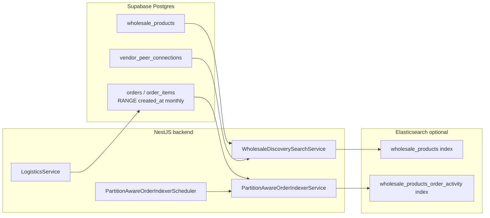

# Wholesale discovery, orders partitioning, and logistics

Operational guide for the B2B wholesale search stack, monthly `orders` partitioning, and US freight route estimation. Code lives in `backend/src/modules/search/`, `backend/src/modules/orders/`, and `backend/src/modules/logistics/`.

## Architecture overview



| Layer | Responsibility |
|-------|----------------|
| **SQL (phase68)** | Monthly RANGE partitions on `orders` / `order_items` keyed by `created_at`; composite PK `(id, created_at)` |
| **Wholesale discovery** | Hybrid ranking: text relevance × connected-vendor boost × proximity; Elasticsearch when configured, Postgres fallback otherwise |
| **Partition indexer** | Hourly partial sync of recent order partitions into `{ELASTICSEARCH_WHOLESALE_INDEX}_order_activity` for ranking signals |
| **Logistics** | `GET /api/orders/:orderId/shipping-options` — US-only freight estimates from vendor geo pins |

---

## Database: orders partitioning (phase68)

### Apply order

Run in Supabase SQL Editor **after** phase63 and all prior scripts:

```
docs/supabase/phase68a_orders_partitioning_strategy.sql   # registry + bounds helper (no data move)
docs/supabase/phase68b_orders_partition_migration_safe.sql  # preferred cutover (resumes partial runs)
```

Alternates (only when the safe script is not appropriate):

- `phase68b_orders_partition_migration.sql` — first-time cutover on a clean `orders` table
- `phase68b_orders_partition_migration_recovery.sql` — when `orders_legacy` / `order_items_legacy` already exist

### Strategy rules

1. **Partition key** — `created_at` (UTC month buckets).
2. **Primary keys** — `(id, created_at)` on both `orders` and `order_items`.
3. **FK** — `order_items` stores `order_created_at` to reference partitioned `orders (id, created_at)`.
4. **Maintenance** — `maintain_orders_partitions(p_months_ahead)` creates monthly child tables ahead of time (default: 2 months).

### Cutover behavior

`phase68b_orders_partition_migration_safe.sql`:

- Renames live `orders` → `orders_legacy` only when the current table is **not** already partitioned.
- Resumes when `orders_legacy` already exists from a prior partial run.
- Maps optional legacy columns (e.g. `transaction_id`) to `NULL` when absent — safe across schema drift.
- Creates `orders_default` / `order_items_default` catch-all partitions during migration.
- Rebuilds partition-pruning indexes (vendor + status + `created_at`, pickup code uniqueness including partition key).

### Post-cutover maintenance

Schedule monthly (pg_cron or manual):

```sql
SELECT public.maintain_orders_partitions(2);
```

Verify partition pruning on time-bounded queries:

```sql
EXPLAIN (ANALYZE, BUFFERS)
SELECT id, created_at, status
FROM public.orders
WHERE created_at >= date_trunc('month', now() AT TIME ZONE 'UTC')
  AND created_at < date_trunc('month', now() AT TIME ZONE 'UTC') + interval '1 month';
```

Expect a single child partition scan, not a sequential scan of all months.

### Troubleshooting

| Symptom | Likely cause | Fix |
|---------|--------------|-----|
| `PARTITION_MIGRATION_BLOCKED REASON=STRATEGY_NOT_APPLIED` | phase68a not run | Apply `phase68a_orders_partitioning_strategy.sql` first |
| `orders_legacy` exists but data not migrated | Partial prior run | Re-run `phase68b_orders_partition_migration_safe.sql` or use `_recovery.sql` |
| Queries slow after cutover | Missing `created_at` filter | Always include `created_at` bounds in order lookups |
| Inserts fail next month | Future partition missing | Run `maintain_orders_partitions(2)` |

---

## Wholesale discovery search

### Entry points

- **API** — `GET /api/vendors/wholesale-products` (search + proximity params) via `WholesaleProductsController`.
- **Service** — `WholesaleDiscoverySearchService.search()` in `backend/src/modules/search/wholesale-discovery-search.service.ts`.

### Ranking model

Hybrid score applied per hit:

1. **Base score** — Elasticsearch `_score` or Postgres text match.
2. **Connected boost** — `score × CONNECTED_WHOLESALER_SCORE_MULTIPLIER` (default **1.2**) when the seller is in the buyer's `ACCEPTED` peer connections (`vendor_peer_connections`, phase64).
3. **Proximity boost** — up to `+PROXIMITY_SCORE_WEIGHT` (default **0.15**) as distance → 0.

Telemetry logs: `RANKING_ALGORITHM_REFINED`, `SEARCH_SCORE_CALCULATED` (when `DEBUG_SEARCH_RANKING=true`), `DISCOVERY_LATENCY_VERIFIED`.

### Query pruning and latency

`discovery-latency.util.ts` builds time-bounded SQL windows for order-activity lookups so Postgres can prune to recent monthly partitions. Target budget: **100 ms** (`DISCOVERY_LATENCY_BUDGET_MS`).

`resolveSearchRouting()` prefers connected vendor IDs for Elasticsearch routing to reduce shards scanned.

### Elasticsearch

| Variable | Default | Purpose |
|----------|---------|---------|
| `ELASTICSEARCH_NODE` | unset | When empty, catalog mutations stay online; ES sync is skipped |
| `ELASTICSEARCH_WHOLESALE_INDEX` | `wholesale_products` | Product catalog index name |
| `CONNECTED_WHOLESALER_SCORE_MULTIPLIER` | `1.2` | Peer-connection relevance boost |
| `PROXIMITY_SCORE_WEIGHT` | `0.15` | Max proximity additive boost |
| `DEBUG_SEARCH_RANKING` | `false` | Emit per-hit score composition logs |

Local ES: `docker compose up -d elasticsearch` (see `backend/docker-compose.yml`).

---

## Partition-aware order indexer cron

`PartitionAwareOrderIndexerScheduler` runs **hourly** (`0 * * * *`) and calls `PartitionAwareOrderIndexerService.syncRecentPartitions()`.

| Variable | Default | Purpose |
|----------|---------|---------|
| `DISCOVERY_PARTITION_SYNC_CRON_ENABLED` | `true` in production, `false` elsewhere | Gate hourly partial sync |
| `DISCOVERY_PARTIAL_INDEX_MONTHS` | `3` | How many recent monthly partitions to scan |

Behavior:

- Skips when `ELASTICSEARCH_NODE` is unset (`PARTITION_AWARE_SYNC_SKIPPED REASON=NODE_UNSET`).
- Uses an in-process lock — concurrent hourly ticks log `SKIPPED REASON=LOCK_HELD`.
- Errors are swallowed so the Nest process is never interrupted.

Target index: `{ELASTICSEARCH_WHOLESALE_INDEX}_order_activity` with `vendor_id` routing.

---

## Logistics: shipping options (phase13)

### Endpoint

```
GET /api/orders/:orderId/shipping-options
Authorization: Bearer <vendor JWT>
Roles: vendor (buyer or seller on the order)
```

Returns ranked US freight routes from seller → buyer vendor geo pins. Uses `RegionalFreightCarrierClient` (mock regional carrier in dev).

### Preconditions

- Both buyer and seller vendors must have `latitude` / `longitude` (phase27 geocoding).
- Both must resolve to US country codes (`isUsCountryCode`).
- Session vendor must be a party on the wholesale order (cross-tenant access returns `B2B_ERROR: ORDER_ACCESS_DENIED`).

### Middleware

`us-logistics-route.middleware.ts` sets `req.logisticsUsRoute.usOnlyRoutes` so the controller filters non-US carriers.

### Verification

```bash
npm run test:wholesale:logistics-service
npm run test:wholesale:logistics-shipping-options
```

---

## Peer connections and retail pricing (phase64–65)

| Phase | SQL | Backend |
|-------|-----|---------|
| **64** | `vendor_peer_connections` (`PENDING` / `ACCEPTED` / `BLOCKED`) | `POST/PATCH /api/vendors/requests` |
| **65** | `wholesale_products.is_retail_enabled`, `retail_price` | Retail SKUs bypass MOQ / peer gates when enabled |

`VendorConnectionsService.listAcceptedPeerVendorIds()` feeds discovery ranking (`CONNECTED_WHOLESALERS`).

---

## Verification commands

Run from repo root (no env overrides required for offline checks):

```bash
npm run test:orders:partition-strategy      # phase68a strategy invariants
npm run test:orders:partition-migration     # migration util + SQL shape checks
npm run test:discovery:partition-indexing   # partial index plan + SQL builders
npm run test:discovery:production-sync-cron # cron gate + schedule registration
npm run test:discovery:latency-benchmark    # latency budget helpers
npm run test:wholesale:logistics-service
npm run test:wholesale:logistics-shipping-options
```

Success markers are uppercase log lines (e.g. `ORDERS_PARTITION_STRATEGY_VERIFIED`, `PRODUCTION_SYNC_CONFIGURED`, `CRON_JOB_REGISTERED`).

---

## Related docs

- [`docs/VENDORLY_MIGRATION.md`](VENDORLY_MIGRATION.md) — full phase apply order through phase68
- [`agent-os/standards/database/supabase-migrations.md`](../agent-os/standards/database/supabase-migrations.md) — migration index
- [`agent-os/standards/backend/nestjs.md`](../agent-os/standards/backend/nestjs.md) — module layout and cron jobs
