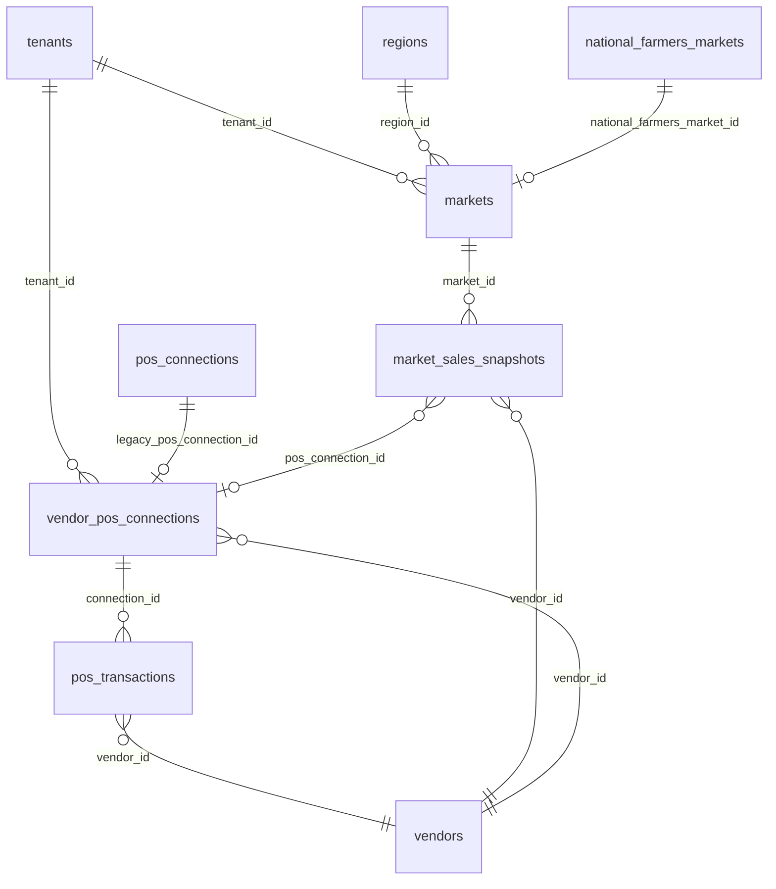

# Phase 44 — National Harvester + POS Analytics Schema Review

**Status:** Draft — **do not apply** until approved  
**Branch:** `cursor/phase44-harvester-pos-schema-428e`  
**Apply order:** `phase44_national_harvester_pos_analytics.sql` → `phase44c_national_harvester_pos_analytics_rls.sql`  
**Prerequisites:** All phases through `phase43c_pos_data_rls.sql`

---

## Executive summary

Phase 44 **extends** existing tables rather than replacing them. The repo already contains:

| User request | Existing foundation | Phase 44 action |
|--------------|---------------------|-----------------|
| `markets` master inventory | `public.markets` (phase42) | **ALTER** — add schedules, geography, national bridge, tenant link |
| National harvest storage | `public.national_farmers_markets` (phase43) | **Unchanged** — harvester ingest target |
| `pos_connections` | `public.pos_connections` (phase12) + `vendor_pos_connections` (phase43) | **ALTER** — tenant routing columns + safe public view |
| `market_sales_snapshots` | — | **CREATE** — new daily rollup table |

---

## Architecture diagram



---

## 1. Market inventory schema

### `public.markets` (extended — phase42 base)

| Column | Type | Purpose |
|--------|------|---------|
| `id`, `name`, `state`, `city`, `latitude`, `longitude` | existing | Master regional market record |
| `operating_schedules` | `jsonb` | Weekly hours / seasonal windows |
| `coordinates` | `geography(point,4326)` | Generated PostGIS point for spatial queries |
| `national_farmers_market_id` | `uuid` FK | Link to USDA/national registry after harvest |
| `tenant_id` | `uuid` FK | Optional direct tenant routing (phase32) |
| `zip_code` | `text` | Address completeness |
| `created_at`, `updated_at` | `timestamptz` | Audit columns (existing) |

**Indexes added:** `state`, `(state, city)`, `tenant_id`, `national_farmers_market_id`, GiST on `coordinates`

**RPC:** `find_nearby_markets(lat, lng, radius_miles, limit)` — regional market proximity (complements phase43 `find_nearby_national_farmers_markets`)

### `public.national_farmers_markets` (phase43 — unchanged)

National harvester (`npm run markets:national:ingest`) continues writing here. Phase 44 links regional `markets` rows via `national_farmers_market_id` after dedupe/match.

---

## 2. POS integration & aggregation layer

### Connection tables (dual stack — by design)

| Table | Stack | Token storage | Active writers |
|-------|-------|---------------|----------------|
| `pos_connections` | Legacy Nest/Prisma (phase12) | `pos_credentials` (encrypted cipher) | Backend API |
| `vendor_pos_connections` | Streamlined OAuth (phase43) | `access_token` / `refresh_token` columns | tenant-web edge (`/api/integration/*`) |

**Phase 44 unification:**
- `tenant_id` + `user_id` on `pos_connections` (tenant routing + RLS)
- `tenant_id` + `legacy_pos_connection_id` on `vendor_pos_connections`
- `pos_connections_public` view — exposes metadata only (no tokens)

### `public.market_sales_snapshots` (new)

Daily rollup per **vendor + market**:

| Column | Purpose |
|--------|---------|
| `gross_volume_cents` / `net_volume_cents` / `platform_fee_cents` | Volume metrics from POS pipeline |
| `transaction_count` | Daily txn count |
| `velocity_index` | Normalized txn/hour for trend charts |
| `payment_method_distribution` | Fractional mix (`card`, `cash`, `other`) |
| `tender_breakdown` | Absolute tender counts from webhooks |
| `source` | `webhook` \| `sync` \| `backfill` \| `manual` |
| `pos_connection_id` | Links to `vendor_pos_connections` |
| `legacy_pos_connection_id` | Optional link to phase12 stack |

**Unique constraint:** `(market_id, vendor_id, snapshot_date)` — one rollup row per vendor per market per day.

**Helper RPC:** `upsert_market_sales_snapshot(market_id, vendor_id, date, ...)` — rebuilds from `pos_transactions` (payment mix filled by webhook workers).

---

## 3. Row-level security (phase44c)

| Table | Policy | Access |
|-------|--------|--------|
| `market_sales_snapshots` | vendor select | Own vendor rows + approved market membership |
| `market_sales_snapshots` | admin all | Full manage |
| `markets` | tenant read (additive) | Active tenant markets |
| `vendor_pos_connections` | tenant select (additive) | Own connections with `tenant_id` set |
| `pos_connections` | vendor select | Own rows when `user_id` populated |
| `pos_connections` | admin all | Full manage |

**Service-role writes:** Webhook ingest and snapshot upserts use `SUPABASE_SERVICE_ROLE_KEY` (bypasses RLS). Anon/authenticated cannot read `pos_credentials` or raw OAuth tokens.

---

## 4. Data flow

```
USDA / national CSV
    └─► national_farmers_markets (phase43 ingest)
            └─► markets.national_farmers_market_id (match/link)

Square / Toast / Clover OAuth
    └─► vendor_pos_connections (tenant-web)
            └─► pos_transactions (realtime ledger, phase43)
                    └─► market_sales_snapshots (daily rollup, phase44)

Legacy Nest POS sync
    └─► pos_connections + pos_credentials (phase12)
            └─► pos_imported_transactions
                    └─► market_sales_snapshots (via backfill worker)
```

---

## 5. Review checklist

- [ ] Approve **extend** vs **replace** strategy for `markets` and `pos_connections`
- [ ] Confirm `market_sales_snapshots` unique key `(market_id, vendor_id, snapshot_date)` is sufficient
- [ ] Confirm dual POS stack (`pos_connections` + `vendor_pos_connections`) is acceptable short-term
- [ ] Confirm `find_nearby_markets` RPC naming (distinct from `find_nearby_national_farmers_markets`)
- [ ] Approve RLS policies before SQL Editor apply

---

## 6. Apply instructions (post-approval)

```sql
-- Supabase SQL Editor, in order:
\i docs/supabase/phase44_national_harvester_pos_analytics.sql
\i docs/supabase/phase44c_national_harvester_pos_analytics_rls.sql
```

Verify:

```bash
npm run build:web
npm run build:tenant-web
npm run smoke:ui-baseline
```

Optional data seed:

```bash
npm run markets:national:ingest:dry   # preview
npm run markets:national:ingest       # write national_farmers_markets
```
